# 🧠 OpenMind OM1 Node – VPS Installation Guide

## 📑 Table of Contents
- Requirements
- Create OpenMind Account & API Key
- SSH Into VPS
- Install Dependencies
- Clone Repository
- Create Virtual Environment
- Add API Key
- Run Node
- Reduce Credit Usage
- Verify Node


> 📸 Screenshots are included for every step below.  
> If images don’t load, check the `/screenshots` folder in this repository.


Run an **OpenMind OM1 node** on **any VPS** (Hetzner, OVH, DigitalOcean, Vultr, Linode, AWS, GCP, etc.).

⏱️ ~10 minutes
💻 Ubuntu 22.04 recommended
💸 Credit usage configurable

---

## 📋 Requirements

* Ubuntu 22.04 VPS
* SSH access with sudo
* Internet connection
* OpenMind account + API key

---

## 🧩 Step 1 – Create OpenMind Account & API Key

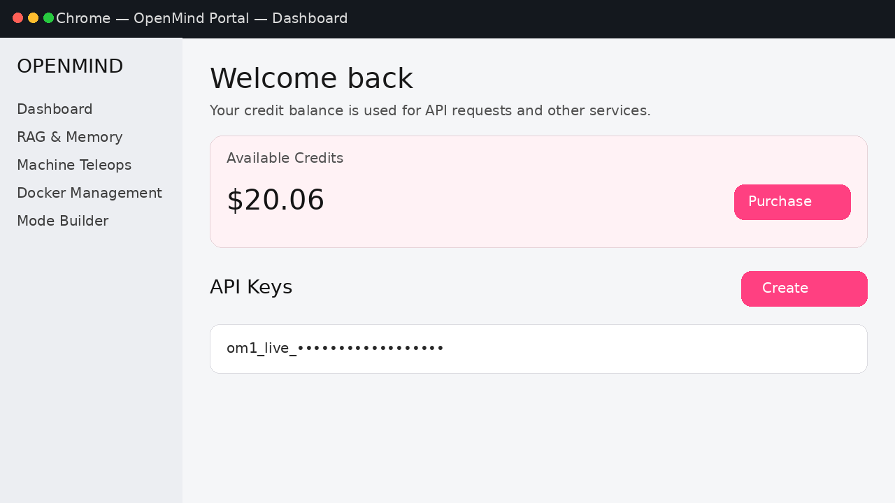


1. Go to 👉 [https://portal.openmind.org](https://portal.openmind.org)
2. Sign in (Google supported)
3. Go to **Dashboard → Purchase Credits**

   * Minimum: **$5**
   * Pay with crypto on **Base network**
4. Go to **Dashboard → Create API Key**
5. Copy & save the API key (you’ll need it later)

---

## 🔑 Step 2 – SSH Into Your VPS

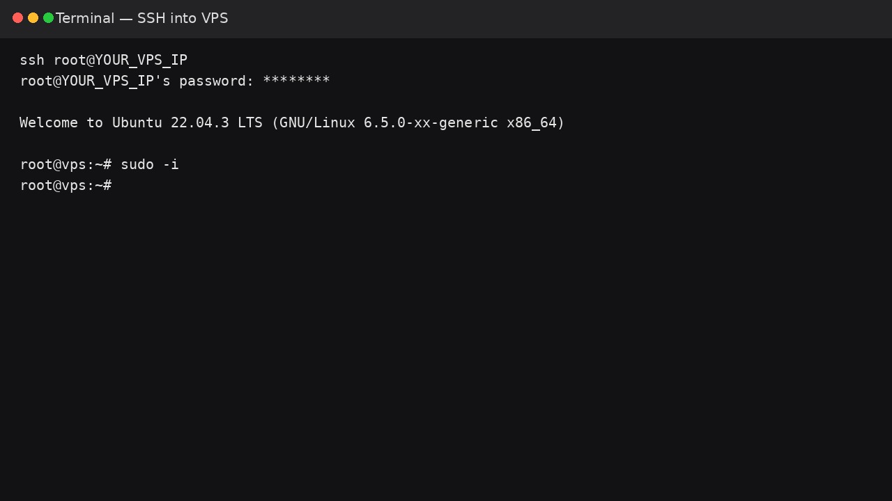


```bash
ssh user@YOUR_VPS_IP
sudo -i
```

---

## 📦 Step 3 – Install System Dependencies

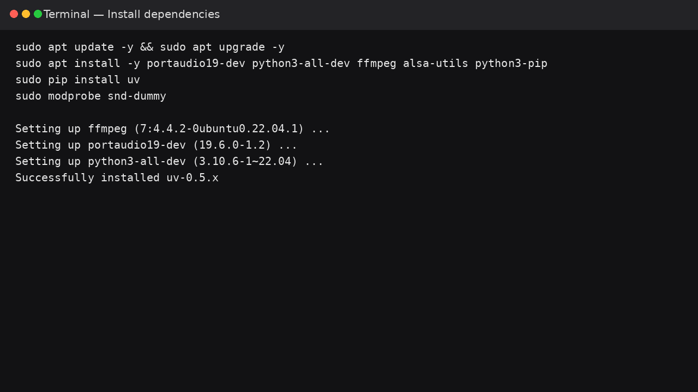


```bash
sudo apt update -y && sudo apt upgrade -y
sudo apt install -y portaudio19-dev python3-all-dev ffmpeg alsa-utils python3-pip
sudo pip install uv
sudo modprobe snd-dummy
```

---

## 📂 Step 4 – Clone OpenMind (OM1)

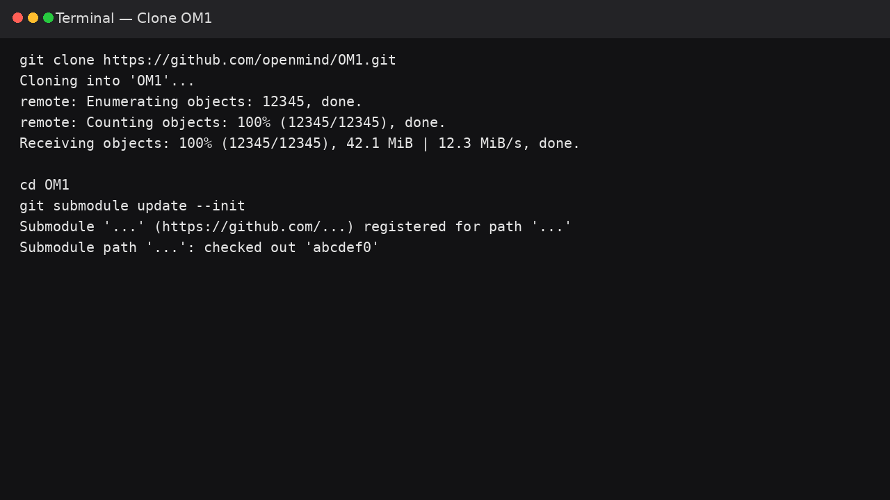


```bash
git clone https://github.com/openmind/OM1.git
cd OM1
git submodule update --init
```

---

## 🧪 Step 5 – Create Virtual Environment

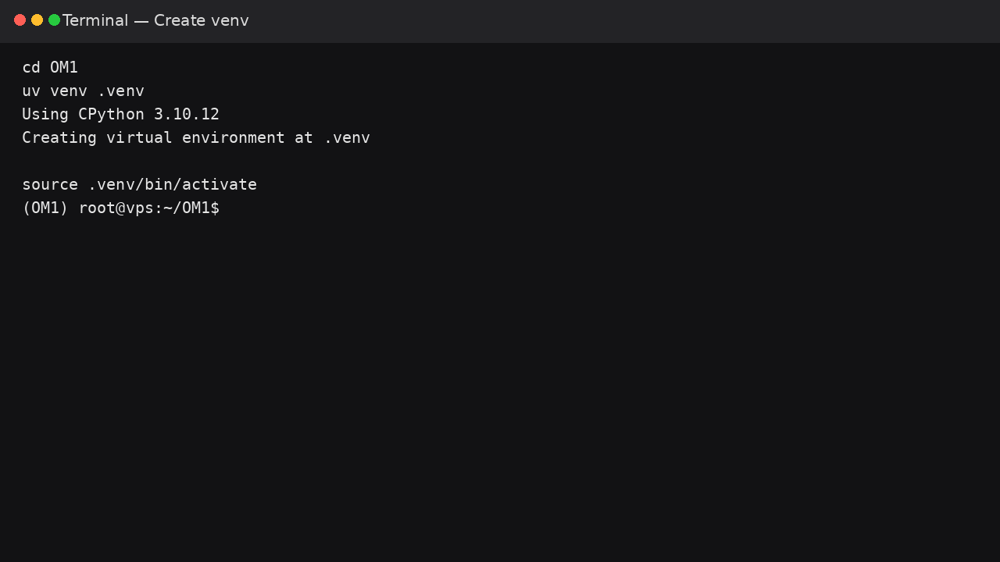


```bash
uv venv .venv
source .venv/bin/activate
```

You should now see `(OM1)` in your terminal.

---

## 🔐 Step 6 – Add Your API Key

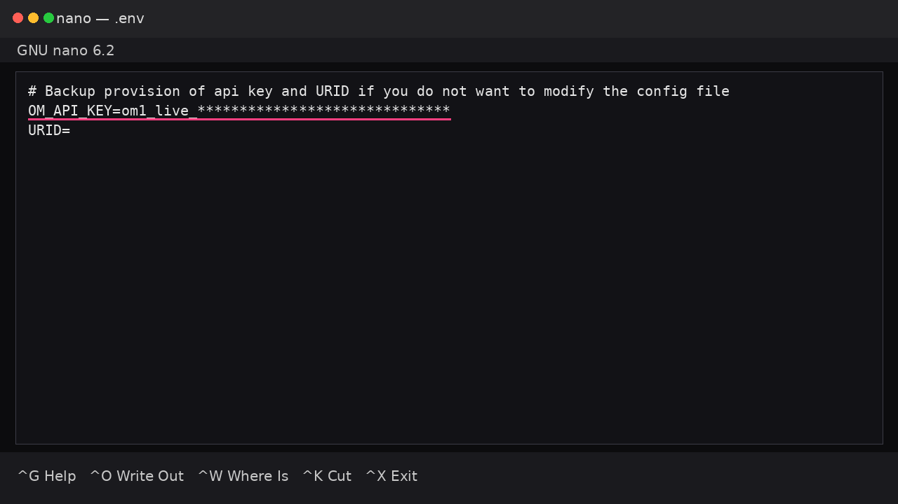


```bash
cp env.example .env
nano .env
```

Paste:

```
OM_API_KEY=om1_live_YOUR_API_KEY_HERE
```

Save with:

```
CTRL + X → Y → Enter
```

---

## 🖥️ Step 7 – Run Node Inside `screen`

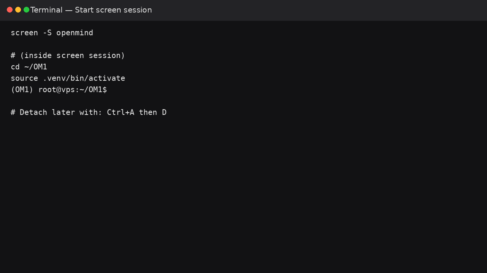
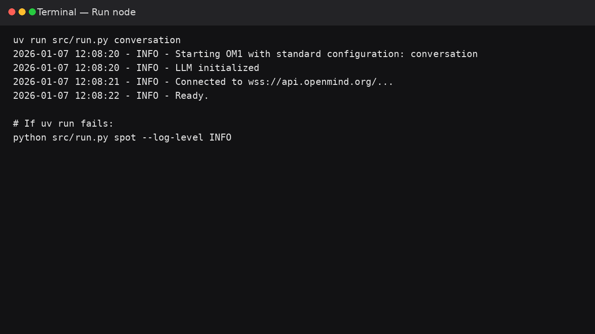


Using `screen` ensures your node keeps running after disconnecting.

```bash
screen -S openmind
cd ~/OM1
source .venv/bin/activate
```

Run node:

```bash
uv run src/run.py conversation
```

If `uv` fails:

```bash
python src/run.py spot --log-level INFO
```

Detach screen:

```
CTRL + A → D
```

Reattach later:

```bash
screen -r openmind
```

---

## ⚠️ Step 8 – Reduce Credit Usage (VERY IMPORTANT)

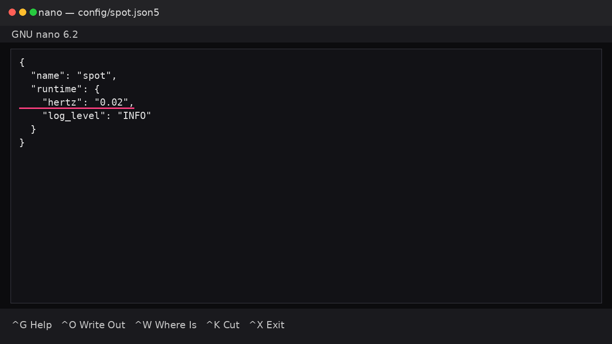


Edit config:

```bash
nano config/spot.json5
```

Change:

```json
"hertz": "0.02"
```

Recommended values:

* `0.02` → low usage
* `0.05` → moderate usage

Save:

```
CTRL + X → Y → Enter
```

⚠️ **IMPORTANT:** Restart the node after changing `hertz`

---

## 🔄 Step 9 – Restart Node

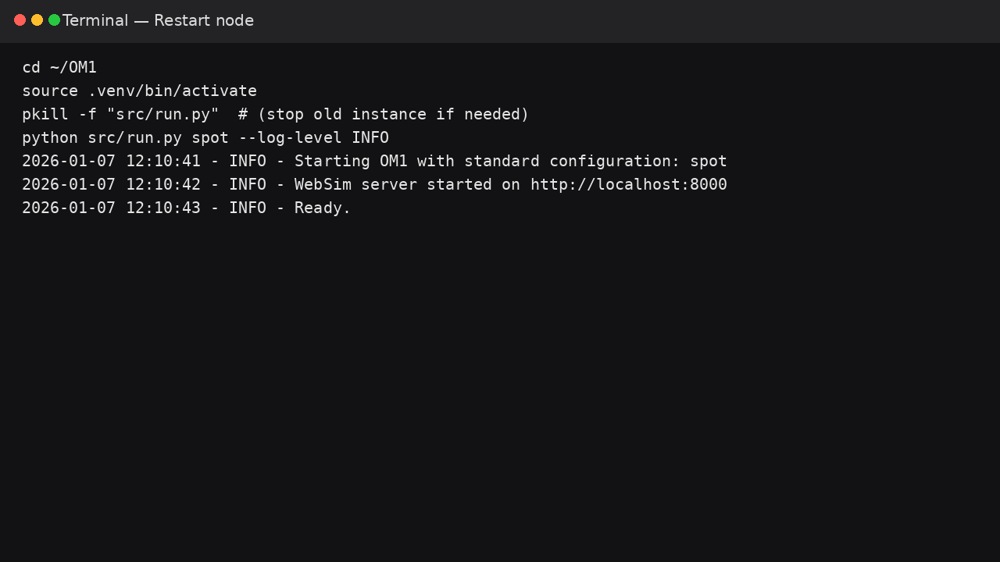


```bash
cd ~/OM1
source .venv/bin/activate
python src/run.py spot --log-level INFO
```

---

## ✅ Step 10 – Verify It’s Working

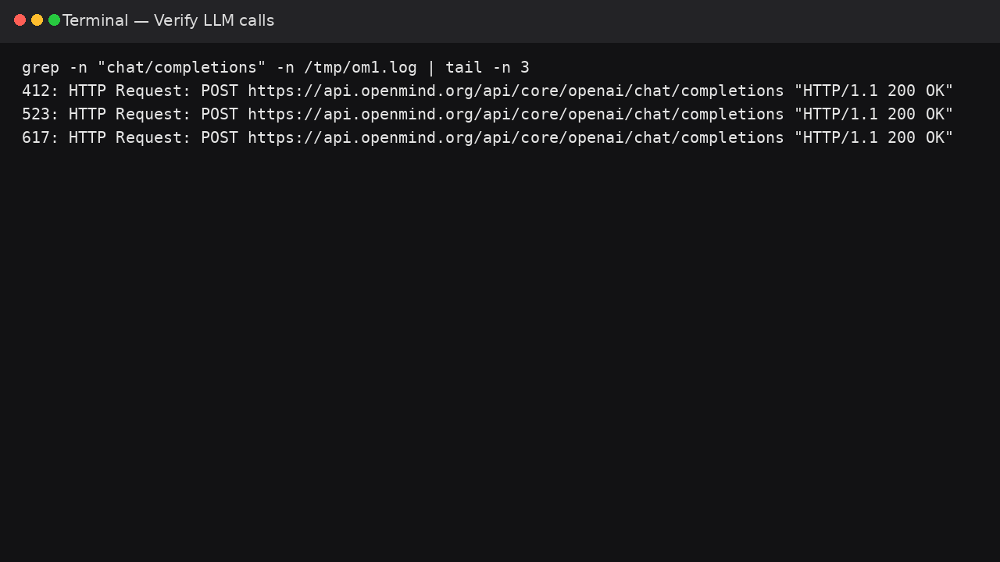
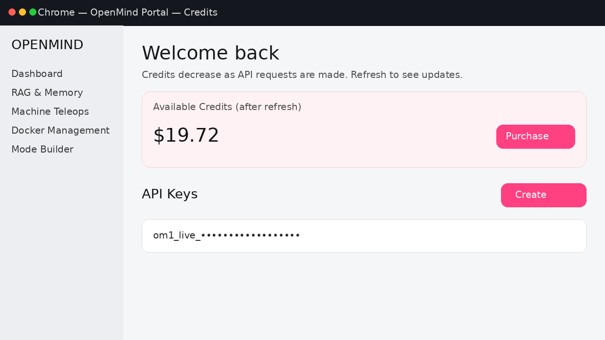


* Check terminal logs for:

  ```
  HTTP Request: POST ... chat/completions
  ```
* Refresh OpenMind dashboard
* Credits should slowly decrease

If credits decrease → **node is live** 🚀

---

## 🛠️ Useful Commands

Stop node:

```bash
pkill -f "src/run.py"
```

Check running processes:

```bash
ps aux | grep run.py
```

---

## ❗ Notes

* WebSim runs on port `8000`
* Audio warnings on VPS are normal
* Credit usage depends on `hertz` value
* Works without robot hardware

---

## 📎 Links

* OpenMind Portal: [https://portal.openmind.org](https://portal.openmind.org)
* OM1 Repository: [https://github.com/openmind/OM1](https://github.com/openmind/OM1)

---

## 🧵 Share

Feel free to share this guide on X, Discord, or GitHub issues to help others get started.


